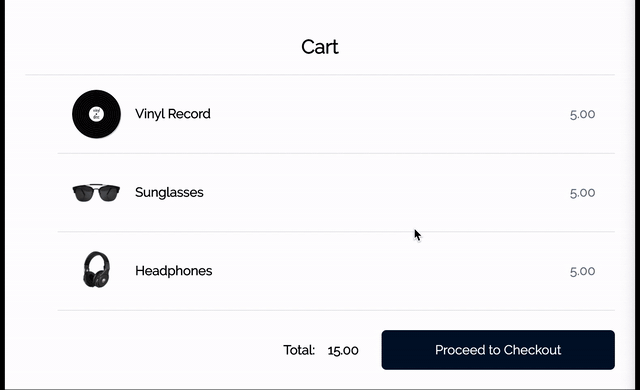

# nodeDrop-in


This demo follows the official [Drop-in web tutorial](https://docs.adyen.com/checkout/drop-in-web/tutorial-node-js) as well as the [Node.js + Express Example](https://github.com/adyen-examples/adyen-node-online-payments) from the Adyen engineering team. Drop-in is built upon [Adyen's API Library](https://github.com/Adyen/adyen-node-api-library), which you can learn more about [here](https://docs.adyen.com/api-explorer/#/PaymentSetupAndVerificationService/v52/overview).

## The goal:
Implement the Adyen Drop-in solution, and process some test payments.

To use Drop-in, users need 3 things:
1. API Key
2. Merchant Account
3. Origin Key

The API key and merchant account info were provided, but origin keys are dependant on the user's shop url and need to be generated/customized as needed to work properly.


## The starting process:
- Step 1: Generate origin keys

Since the Drop-in component is primarily powered by API responses, I figured I would follow the directions outlined in the guide to [Generating Multiple Origin Keys](https://docs.adyen.com/user-management/how-to-get-an-origin-key#generate-multiple-origin-keysTest) and generate a response in Postman using the provided API Key and potentially also the Merchant Account information as headers. I knew that I would only be testing payments locally, so I really only needed to generate a key for https://localhost:8080 as my origin domain. However, when testing this in Postman, I would receive this error message:


I had originally thought that there might have been an error with the API key or merchant account name, however testing these credentials by entering the following code in the terminal returned a positive response as well as a valid origin key. In fact, I didn't even need the merchant account name yet this early in the process.

```
curl https://checkout-test.adyen.com/v1/originKeys \
-H "X-API-key: "[******** API KEY REDACTED *********]" \
-H "Content-Type: application/json" \
-d '{
   "originDomains":[
      "http://www.localhost:8080",
   ]
}'
```

Once the origin key was generated, we were pretty much good to go as that was the only missing piece credential-wise. Upon further research, I actually discovered that Adyen actually has its own [OpenAPI specification](https://github.com/Adyen/adyen-openapi) that I could have imported into Postman. You can learn more about this [here](https://www.adyen.com/blog/improving-the-developer-experience-with-openapi-specification).


## The implementation process:

- Step 2. Add credentials + Adyen scripts

Implementation was relatively straightforward thanks to the fantastic documentation outlined in the original tutorial and example, and for added security, I did include an Environment Variable (.env) file where I could safely keep my credentials hidden away. To ensure that credentials would not get leaked to GitHub, I created a .gitignore file and added ".env" for extra peace of mind (highly recommended practice!) The repo README from the [original example on GitHub](https://github.com/adyen-examples/adyen-node-online-payments) has great instructions on how to do this. To use the .env file with Node, you will need to install another dependency, [Dotenv](https://www.npmjs.com/package/dotenv), which you can do by running the following command in your terminal while still in your root folder:

```npm i dotenv```

Alternatively, if you have yarn installed, you can also run ```yarn add dotenv```, however it's not recommend to mix package managers, and yarn will yell at you for this.

Because the original documentation and instructions are so well-written, I won't go into too much detail about the specific endpoints and server functions necessary to get Drop-in up and working, but I will mention that I did create two separate .js files to keep general backend (Express) logic and specific Drop-in configuration logic separate. Adyen Drop-in configuration functions can be found in "public/adyen.js", and "index.js" in the root folder serves everything else backend-wise.

The "website" layout and component heirarchy is pretty much typical of any MVC (model-view-controller) setup, however there really isn't any model (database) in this specific example.  Handlebars and Drop-in serve as the front-end client-facing "view", and index.js + adyen.js serve as the back-end Express logic "controllers" that allows the server to communicate with the API.

To make Drop-in viewable, the Adyen script + CSS file must both be imported into your main (home)page. Here they are below:
```
<script src="https://checkoutshopper-test.adyen.com/checkoutshopper/sdk/3.9.5/adyen.js"
   integrity="sha384-xXs1tPf7iFMwbRiKdAsFcjBr2vdHL5HtYzWRc9y7hRwDDrtneGA4E6saDmXi+KrY"
   crossorigin="anonymous"></script>
```
```
<link rel="stylesheet" href="https://checkoutshopper-test.adyen.com/checkoutshopper/sdk/3.9.5/adyen.css"
    integrity="sha384-6qrXvoxlnBlrflZQ9g5Yf5oZapUSSXctPxacP9oRcEukbEO7lXisuSyMKG8pDX8V"
    crossorigin="anonymous">
 ```
Note: in hindsight, it probably wasn't a good idea to also name my implementation config file "adyen.js". In the future I'd probably rename it "implementation.js" or something similar to prevent any confusion.

## The testing process:

- Step 3. Test some payments!

"Dummy" test card numbers are available from Adyen [here](https://docs.adyen.com/development-resources/test-cards/test-card-numbers) and were used to process some test payments to make sure that checkout endpoints were functional and in proper working order. Before testing Drop-in on the "website", I tested server endpoints in the terminal by sending requests to the API such as this one below:

```
curl https://checkout-test.adyen.com/v52/paymentMethods \
-H "x-API-key: "[******** API KEY REDACTED *********]" \
-H "content-type: application/json" \
-d '{
  "merchantAccount": "[****** MERCHANT ACCOUNT REDACTED ******]",
  "countryCode": "US",
  "amount": {
    "currency": "USD",
    "value": 1500
  },
  "channel": "Web",
  "shopperLocale": "us-US"
}'
```

To make sure everything was working on the front-end UI after the "back-end" API calls returned positive responses, I tested the UI with similar test payments as illustrated below:



Great success! 

If you'd like to try this implementation example on your machine (with your own credentials), please follow these steps by entering the following code in your terminal:
1.  ```git clone https://github.com/ttolentino89/nodeDrop-in.git```
2.  ```cd nodeDrop-in```
3.  ```cd dropin```
4.  ```npm install```
5.  ```npm start```

Once your server is running, you can visit http://localhost:8080 to view a "live" demo in your browser.  You will know that your server has been started successfully if you receive the a similar message in your terminal as pictured below:


If you're not familiar with using the terminal or command line interface (CLI) on your computer, that's totally okay! There's a great tutorial on common CLI commands [here](https://blog.galvanize.com/how-to-use-the-terminal-command-line/) that I highly recommend for first-timers.


## Observations:

- I had actually originally wanted to try implementing this in Ruby (on Rails) since it's the language and framework I have the least experience in but would love to practice, but it appears there might be an issue with the [example repo](https://github.com/adyen-examples/adyen-rails-online-payments). The instructions say to run ```bundle install```, however that is an action reserved for Ruby version 2.6.4 (and possibly newer versions) and the current repo is written in Ruby 2.4, at least on the master branch. Is this a typo? I haven't tried cloning or running this yet, but I might open an issue or Pull Request on GitHub if this is the case.

-  Speaking of typos, there is a slight error in the Node.js + Express Drop-in tutorial instructions: 
- This should be "handlebars", and not "handlesbars". The correct code is ```npm install --save express @adyen/api-library express-handlebars cookie-parser```, an extra 's' makes all the difference in terms of bugs!

- The Node.js + Express tutorial does not include instructions for what to include in the helpers file(s) in the (required?) util folder, aside from the fact that it is necessary when instantiating handlebars as your Node "viewer" with the following code below:
```
app.engine(
  "handlebars",
  hbs({
    defaultLayout: "main",
    layoutsDir: __dirname + "/views/layouts",
    partialsDir: __dirname + "/views/partials",
    helpers: require("./util/helpers")
  })
);
```
- Drop-in configuration already has client-facing UI, so is it necessary to have helper functions for this to run properly? To be honest, I'm not exactly sure what the helper functions do in this case, but I would love to learn more about this.

- I had tried (and failed) several times to get the React Drop-In example to work with a [Gatsby](https://www.gatsbyjs.org/) eCommerce starter. Gatsby is my preferred open-source framework built with React with half the runtime speed and in my opinion, twice as much support since it comes with GraphQL right from the start. However, Gatsby does have its own quirks, and since Adyen's React Example uses ```<Provider />``` from Redux toolkits, it doesn't play well with how Gatsby renders the DOM, at least from my initial observations. I'd love to learn if there's a way around this, as I was unable to find any documentation about any users successfully using Adyen with Gatsby, and I hope there are a few out there that I could potentially learn from!


## Special thanks to

Ms. Leslie Cruz (Implementation Team Lead) & Ms. Casey Roth (US Recruiter) for giving me the chance to work on this assignment and also for having faith in me for getting this far! I had a blast working on this exercise and it was definitely a fun learning experience, so thank you again for everything!

